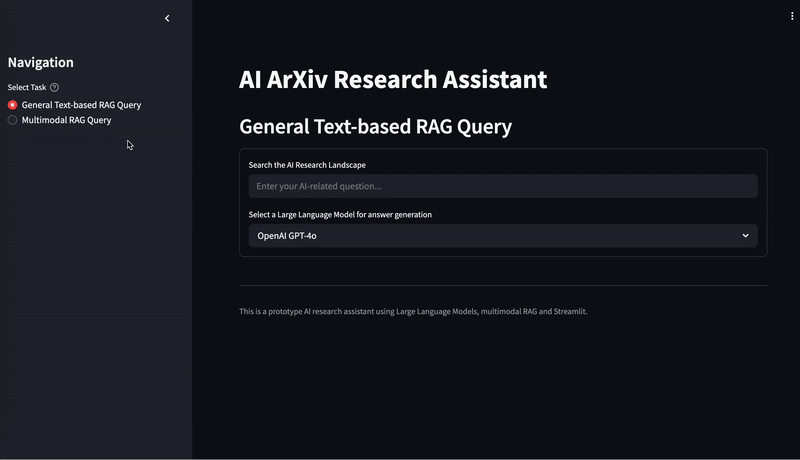

# arXiv Research Assistant: Multi-Agent and Multimodal RAG with Fine-tuned LLMs


This project implements an agent-based, RAG-based AI research assistant prototype capable of retrieving multimodal context and answering complex queries about AI-related scientific papers on [arXiv](https://www.kaggle.com/datasets/Cornell-University/arxiv). It also demonstrates an efficient fine-tuning approach for Large Language Models (LLMs) for a domain- or language-specific downstream task. The prototype leverages a mix of state-of-the-art open-source tools (e.g., HuggingFace, LlamaIndex) and hosted APIs (e.g., OpenAI, Groq) for LLM applications, as well as custom fine-tuned LLMs. It can be extended to further tasks or adapted to other domain-specific use cases. 


## Table of contents

* [Demo](#demo)
* [Project Highlights](#project-highlights)
* [Getting Started](#getting-started)
* [Preprocessing Data and Creating VectorStoreIndex](#preprocessing-data-and-creating-VectorStoreIndex)
* [Modular Multi-Agent System with a Router](#modular-multi-agent-system-with-a-router)
* [Multimodal RAG](#multimodal-rag)
* [Fine-tuning LLMs for Domain-/Language-Specific Generation](#fine-tuning-LLMs-for-domain-/language-specific-generation)
* [Running the Streamlit App](#running-the-streamlit-app)
* [TODOs](#todos)


## Demo

1. **Mode: General Text-based RAG Query**

> *Example use cases:*
>
> - Retrieve top-*k* relevant arXiv papers for a general query and use their abstracts (and not prior knowledge) as context for generating answers - "Retrieved Context Papers" are shown with links to read in full
>
> - Act as a recommender engine that searches for relevant papers for a given research topic
>
> - Assist in literature reviews in further ways such as code implementation, fact-checking, summarization, and information extraction from scientific papers


<div align="center">
  
</div>
<br><br>


2. **Mode: Multimodal RAG Query**

Answer paper-specific queries using both textual and visual context (figures/tables) from the paper's PDF (loaded via arXiv URL)


<div align="center">
  
</div>


## Project Highlights

- **Modular Multi-Agent Architecture:** Specialized LLM-based agents for distinct tasks, with a central **Router Agent** that dynamically selects the appropriate agent for a query.

- **Efficient Local Vector Search for RAG:** Fast document retrieval powered by ChromaDB using vector representations generated with embedding models from HuggingFace/OpenAI.

- **Multimodal RAG Pipeline:** Combines both text- and image-based context for comprehensive answers about specific papers that contain figures and tables.

- **Custom LLM Finetuning:** LoRA-based Parameter-Efficient Fine-Tuning (PEFT) technique enables efficient domain or language adaptation with minimal training overhead.

- **Experiment Tracking:** Fine-tuning processes are logged using [Weights & Biases](https://wandb.ai/site) or [Tensorboard](https://www.tensorflow.org/tensorboard).

- **Streamlit UI:** Interactive frontend to explore two modes of the prototype: text-based RAG (for general queries) or multimodal RAG (for paper-specific queries).


## Getting Started

### Prerequisites
- Python 3.12
- PyTorch 2.6.0
- ChromaDB
- HuggingFace tools (`datasets`, `transformers`) and account with access token
- OpenAI API key and `openai` package
- LangChain ecosystem packages (see `environment.yaml`)
- LlamaIndex ecosystem packages (see `environment.yaml`)
- `unsloth`, `peft`, `bitsandbytes`, `trl` (for accelerated PEFT-style LLM fine-tuning)
- Streamlit

> **Note:** A GPU is also required, especially for fine-tuning LLMs.


### Installation

1. **Clone the repository**:

   ```bash
   git clone https://github.com/myng15/arxiv-llm-rag-research-assistant.git
   ```

2. **Set up the environment and install the required packages**:

   ```bash
   conda env create -f environment.yaml
   conda activate arxiv-llm-env
   ```

3. **Configure API keys**:

Create a .env file in the root project directory with the following environment variables:

   ```bash
    HF_TOKEN=<your-huggingface-token>
    GROQ_API_KEY=<your-groq-api-key>
    OPENAI_API_KEY=<your-openai-api-key>
    LANGCHAIN_API_KEY=<your-langchain-api-key> # generated on LangSmith (LangChain platform)
   ```

## Preprocessing Data and Creating VectorStoreIndex 

1. **Download the dataset**:

Download the [arXiv metadata dataset](https://www.kaggle.com/datasets/Cornell-University/arxiv) locally before proceeding.


2. **Preprocess the data**:

Since this prototype is designed to assist in AI/ML-related research, the dataset is filtered to include only papers from relevant arXiv categories (e.g., `cs.AI`, `cs.LG`, `cs.CV`). Other preprocessing steps include extracting key fields such as `title`, `abstract`, and `id`, and storing the processed data in a CSV. 

To preprocess the dataset, run:

   ```bash
   python preprocess_data.py
   ```

3. **Create VectorStoreIndex**:

To enable semantic search in our Retrieval-Augmented Generation (RAG) pipeline, we embed documents (concatenated title + abstract of each paper) and store them in a ChromaDB vector database using LlamaIndex:

   ```bash
   python create_index.py
   ```

This setup is one-time. The resulting index will be reused during retrieval.


## Modular Multi-Agent System with a Router

- **Query Agent:** Handles general text-based RAG queries using retrieved arXiv abstracts. Supports both pre-trained and (custom) fine-tuned LLMs for generation.

- **Code Agent:** Responds to programming-related queries with code and explanations generated with models like CodeGemma. 

- **Router Agent:** Uses an LLM (e.g., Gemma) via LlamaIndex to classify incoming queries and route them to the appropriate agent based on task type (e.g., searching answers among arXiv papers and relationships between them vs. answering coding questions).


## Multimodal RAG

**Multimodal Agent:** Handles detailed queries about a specific arXiv paper by analyzing both the text and figures/tables in its PDF (loaded via arXiv URL). 

- Structured PDF parsing using [Unstructured](https://unstructured.io/)

- Summary generation from both text and visual content using LLMs (e.g., Llama 3.1 for text, GPT-4o-mini for vision)

- Storage of multimodal summaries in ChromaDB

- Construction of multimodal prompts for GPT-4o-mini and of RAG pipeline using LangChain


## Fine-tuning LLMs for Domain-/Language-Specific Generation

The project also implements PEFT using (Q)LoRA adapters to fine-tune LLMs (e.g., Gemma-3) for instruction-following in specific domains or languages.

Examples: 

- Fine-tune Gemma-3 for tasks specific to arXiv scientific papers:

   ```bash
   python finetuning/gemma-3-fine-tuned-arxiv-instruct.py
   ```

- Fine-tune Gemma-3 for following instructions in German:

   ```bash
   python finetuning/gemma-3-fine-tuned-german-alpaca.py
   ```

> Currently, fine-tuned LLMs are used by the Query Agent only.


## Running the Streamlit App

Launch the assistant with:

   ```bash
   streamlit run app.py
   ```


## TODOs
- [ ] Integrate in-chat memory (assistant remembering previous interactions within a session)
- [ ] Enable streaming when generating answers
- [ ] Enhance paper recommendation feature with citation graph-based reasoning
- [ ] Explore LangGraph for agent orchestration

